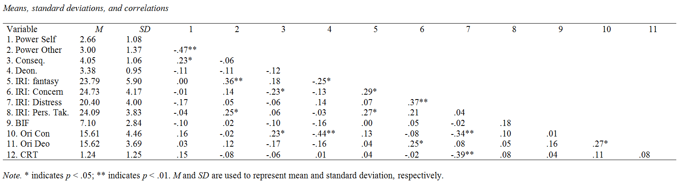

```{r setup, include=FALSE}
knitr::opts_chunk$set(echo = TRUE)
```
<br>
This page contains:  
  
-  a short description of this study   
-  a link to the  Open Science Framework page associated with each publication that archives the data and materials.   
  
Please note that this has not been peer reviewed. Co-authors mentioned were cooperators on these studies but did not involve themselves with the current write-up. Any mistakes are mine and mine alone. Any opinions expressed are mine personally.

The data of these studies and some basic statistical code is available on <a href="https://osf.io/f3aj8/">Open Science</a>. 
***

####Power and Consequentialist moral Judgment
D.H. Bostyn, K. Thiryn & A. Roets
<br>  
<br>
  
#####Introduction
The idea for the current study came about after reading the article <a href="https://dx.doi.org/10.1037/a0015437">"How Power Influences Moral Thinking"</a> by Joris Lammers & Diederik Stapel (2009). Given the controversies surrounding Diederik Stapel, I want to explicitly mention that we did not intend our work to be a replication test of this earlier work. As far as I am aware, the referenced article has been cleared of the charges against Stapel. 
  
In a set of five studies, Lammers & Stapel (2009) found that power increased rule-based (deontological) moral thinking. However, unlike most of the literature on trolley dilemmas Lammers & Stapel focused on moral dilemmas, that did not involve the extreme life-or-death situations that most of trolley research has focused on. As such, we wanted to built on this earlier work and test if their findings would generalize to this other type of moral dilemmas; a suggestion they themselves made in the discussion of their results.  
  
Building on the person-centered approach to moral cognition and the recent findings on the relationship between anti-social tendencies and consequentialist moral judgment, I  was actually expecting to find that power would increase consequentialist moral judgment for responses to traditional extreme harm trolley dilemmas. My cooperators and me explored this basic idea in a set of two studies, the second of which was part of K. Thiryn's Masters Thesis.
<br>  
<br>  
  
#####Method: Study 1
Data was gathered on Mturk. We aimed to gather 140 participants but ended up with 148. I've noticed that happens sometimes on mTurk, though I'm not exactly sure why. I can only assume that some mTurkers forget to register their completion of the study.  
  
Participants completed an online questionnaire that measured:  
  
- some basic demographic information   
- Personal Sense of Power scale (<a href="https://dx.doi.org/10.1111/j.1467-6494.2011.00734.x">Anderson, John, & Keltner, 2012</a>)  
- a 4 item Behavioral Inhibition / Behavioral Activation questionnaire (<a href="https://dx.doi.org/10.1037/0022-3514.67.2.319">Carver & White, 1994</a>)
- 5 items from the Behavior Identification From to measure abstract thinking (<a href="https://dx.doi.org/10.1037/0022-3514.57.4.660">Vallacher & Wegner, 1989</a>)  
- Consequentialist moral reasoning as measured by participants binary responses to a 10 item moral dilemma battery ("Is it appropriate to do the consequentialist action?")  
  
The Sense of Power questionnaire was included because Lammers & Stapel uncovered it was significantly (negatively) associated with consequentialist moral reasoning. The Abstract thinking questionnaire was included because Lammers & Stapel uncovered the former effect was mediated by participants level of abstract thinking. And finally, the BIS/BAS measure was included for exploratory purposes.  
<br>
<br>
  
#####Results: Study 1 
Although participants' sense of power was marginally positively associated with their level of abstract thinking, *r* = .15, *p* = .079, sense of power did not appear to be associated with our measure of consequentialist moral reasoning, *r* = -.02, *p* = .803.  
  
For the sake of transparancy: consequentialist moral reasoning appeared to be associated with behavioral inhibition, *r* = -.16, *p* = .046 but not with any of the other measures.  
<br>
<br>
  
#####Cursory Discussion: Study 1
In this initial study we did not find any evidence for an association of participants' Sense of Power and their preference for consequentialist moral reasoning.  

To further explore this basic idea, we ran a second study in which we aimed to manipulate participants' feelings of power more directly.  
<br>
<br>
  
#####Method: Study 2
Data was gathered by K. Thiryn from general population volunteers using snowball sampling on social media. A total of 80 participants completed this study, which admittedly, is somewhat too small to reliably find an experimental effect.  
  
Participants completed an online questionnaire that was structered as follows: 
  
- some basic demographic information 
- An experimental priming manipulation of power (Please, describe a situation in which you felt powerfull/powerless)
- Two rating scales measuring to what extent participants' felt they had power, or others had power over them as a manipulation check.
- A ten item moral dilemma battery measuring participants' preference for both consequentialist and deontological moral reasoning
- The Interpersonal Reactivity Index which measures Empathy through 4 subconstructs: Fantasy, Empathic Concern, Perspective Taking, Emotional Distress. (<a href="https://dx.doi.org/10.1037/0022-3514.44.1.113 ">Davis, 1983</a>)
- 10 items from the Behavior Identification From to measure abstract thinking (<a href="https://dx.doi.org/10.1037/0022-3514.57.4.660">Vallacher & Wegner, 1989</a>)  
- Orientations towards Deontological or Consequentialist thinking Scale (<a href="https://dx.doi.org/10.1002/ejsp.493">Tanner, Medin, & Iliev, 2008</a>)
- Cognitive Reflection Test (<a href="http://www.jstor.org/stable/4134953">Frederick, 2005</a>)

The CRT was included as an exploratory measure.
<br>
<br>
  
#####Results: Study 2
Although our experimental manipulation did influence both manipulation checks, both |*t*|(78) > -5.05, *p* < .001, the manipulation did not appear to influence participants' preference for consequentialist reasoning, *t*(78) = 1.63, *p* = .108, their preference for deontological reasoning *t*(78) = 0.96, *p* = .341, nor their levels of abstract thinking *t*(78) = -0.87, *p* = .386.

A correlation matrix displaying the remaining results is presented in the following table:


<br>
<br>
  
#####Cursory Discussion
Across two studies we did not uncover much evidence that power is related to a specific preference towards a certain type of moral reasoning. The most important caveat for these conclusions is that both studies were run on fairly small samples and thus suffer from an obvious lack of power. In this regard, it is perhaps worth mentioning that, although it did not reach significance, the estimated effect of the power manipulation on participants' preference for consequentialist moral reasoning was *Cohen's D* = 0.36. 

Nevertheless, given the sparcity of results we decided not to continue this research project. Please note that this post is not intended as a repudiation of the earlier work by Lammers & Stapel. Our studies have a number of obvious limitations and more importantly: the dilemmas we used are quite unlike the ones used in their studies. This difference alone can easily explain our diverging results.  

<br>
